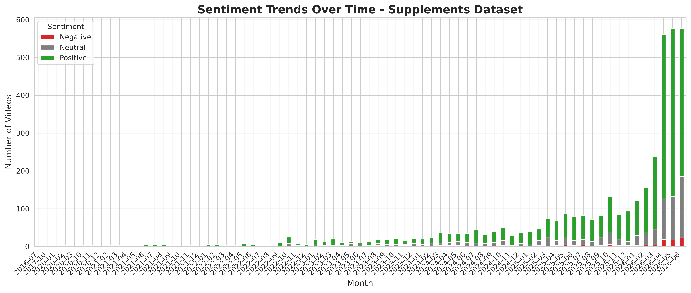
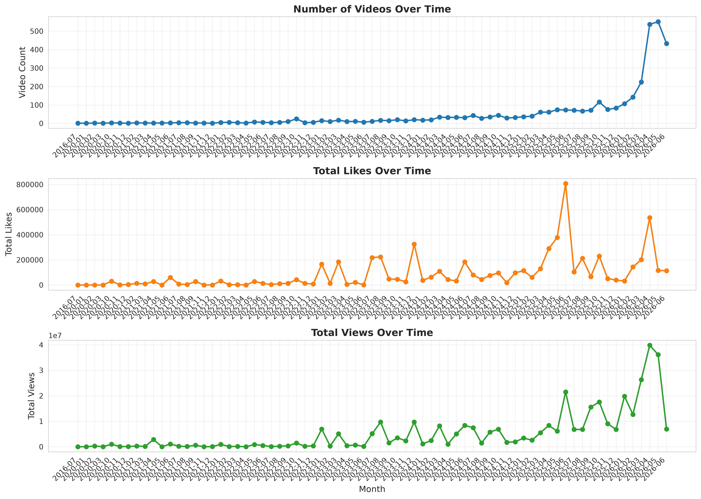
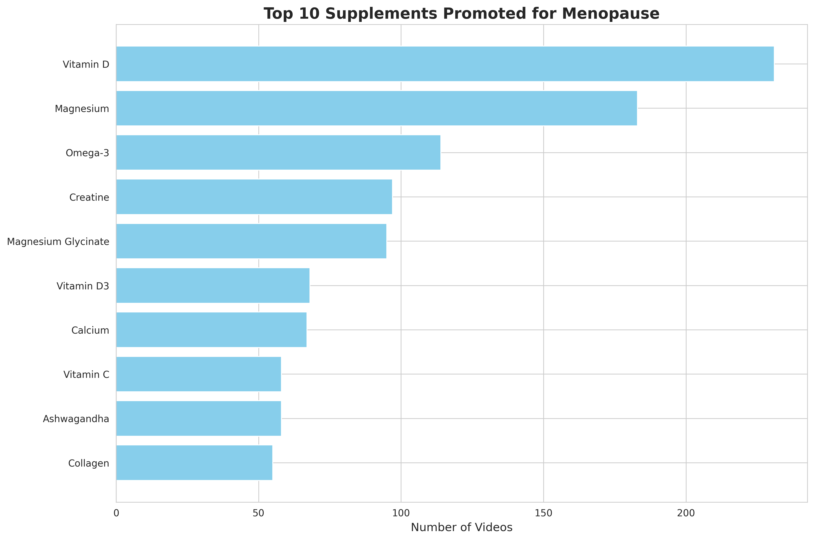
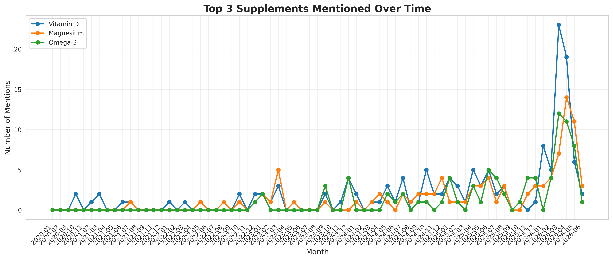
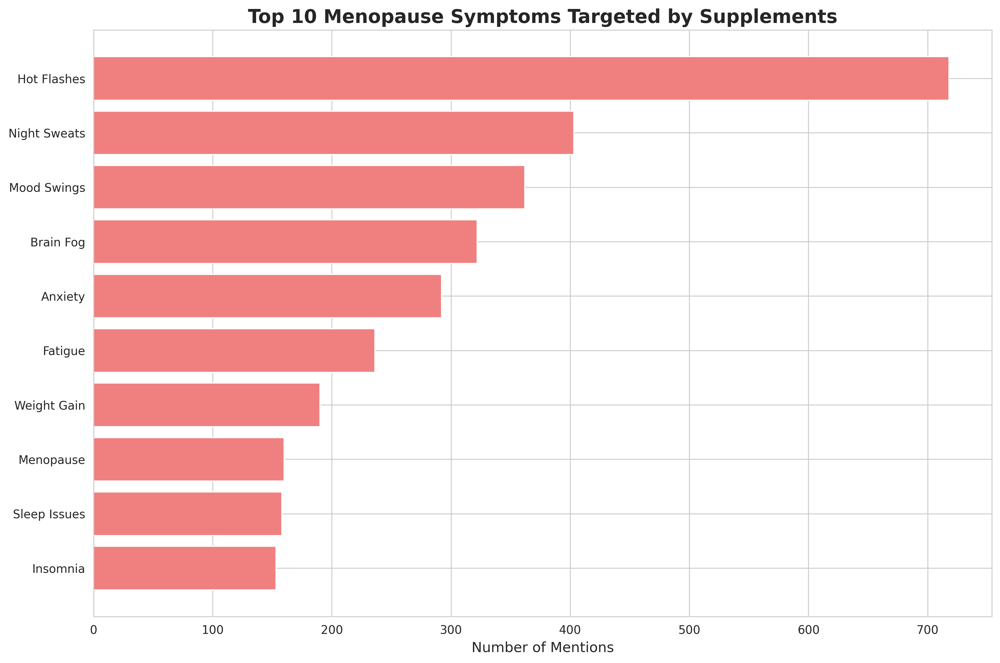
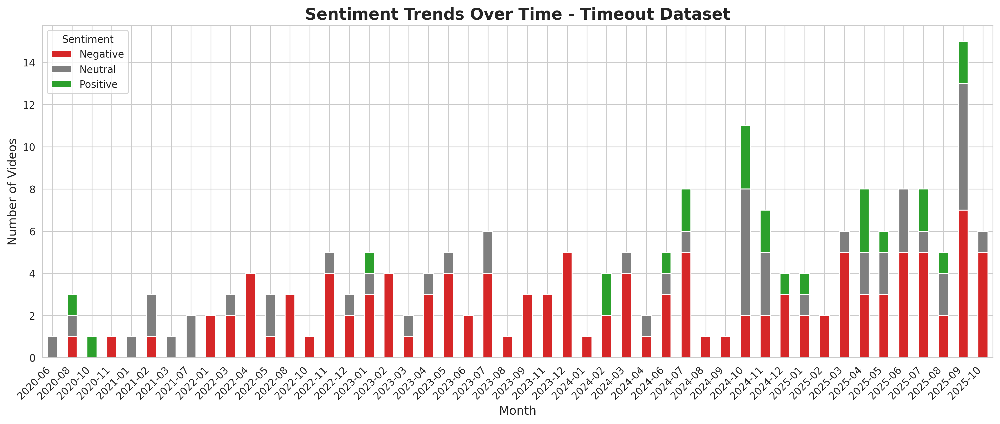
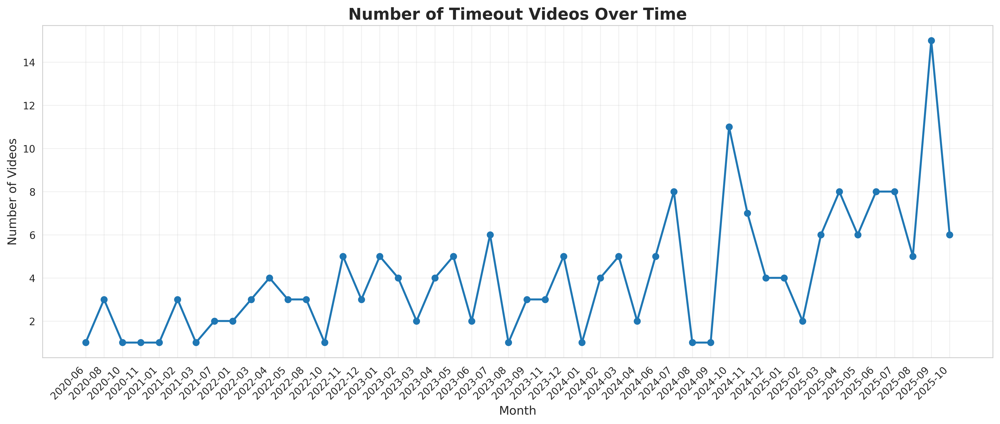

# Timeout and Menopause Supplement Video Research

[](https://deepwiki.com/UoA-eResearch/timeout)
[](https://github.com/UoA-eResearch/timeout/actions/workflows/googlesearch.yml)
[](https://github.com/UoA-eResearch/timeout/actions/workflows/analyze_data.yml)

This repository collects and analyzes short-form videos about parenting timeout strategies and menopause-related supplements using automated Google Search scraping and AI-powered video analysis.

## Overview

The project consists of two main components:

1. **Google Search Scraper** (`src/run_googlesearch.py`) - Automatically scrapes Google search results for short videos
2. **Video Analysis** (`src/batch_LLM.py`) - Processes videos using a large language model to extract structured information

## Installation

### Basic Requirements

```bash
uv pip install -r requirements.txt
```

### For Google Search Scraping

```bash
pip install -r requirements-googlesearch.txt
```

Required Python packages:
- pandas
- tqdm
- selenium
- undetected-chromedriver

System packages (for Tor support):
- tor
- torsocks
- chromium/chrome browser

## Usage

### 1. Google Search Scraper (`src/run_googlesearch.py`)

This script scrapes Google search results for short videos related to:
- **Timeout dataset**: `#parenting #timeout` and `#gentleparenting #timeout`
- **Supplements dataset**: `#menopause #supplements` and `#menopause #vitamins`

#### Run the scraper locally:

```bash
# Normal execution (scrapes both datasets)
python3 src/run_googlesearch.py

# With Tor (if IP blocked)
torsocks python3 src/run_googlesearch.py

# Or use the --use-tor flag
python3 src/run_googlesearch.py --use-tor
```

#### How it works:

1. Searches Google for the specified hashtag combinations
2. Clicks on "Short videos" filter
3. Scrolls to load more results and clicks "More results" button
4. Scrapes video metadata: link, duration, title, source, author
5. Combines results with previous data
6. Filters to include only Instagram, TikTok, YouTube, and Facebook videos
7. Saves results to CSV and text files

#### Output files:

**Timeout dataset:**
- `data/timeout.csv` - Full results with columns: link, duration, title, source, author
- `data/timeout_links.txt` - Just the links, one per line

**Supplements dataset:**
- `data/supplements.csv` - Full results with columns: link, duration, title, source, author
- `data/supplements_links.txt` - Just the links, one per line

#### IP Blocking Protection:

The scraper includes automatic protection against IP blocking:
1. First attempts to run without Tor
2. If that fails (likely due to IP blocking), automatically retries with Tor/torsocks
3. Tor provides anonymity and helps avoid rate limiting

#### Automated Execution:

The repository includes a GitHub Actions workflow (`.github/workflows/googlesearch.yml`) that:
- Runs daily at 2 AM UTC (configurable via cron schedule)
- Can also be triggered manually via GitHub Actions UI
- Automatically commits updated CSV files back to the repository

To trigger manually:
1. Go to the "Actions" tab in GitHub
2. Select "Google Search Scraper" workflow
3. Click "Run workflow"

To change the schedule, edit the cron expression in `.github/workflows/googlesearch.yml`:
```yaml
schedule:
  - cron: '0 2 * * *'  # Daily at 2 AM UTC
```

Common cron schedules:
- `0 */6 * * *` - Every 6 hours
- `0 0 * * 0` - Weekly on Sunday at midnight
- `0 0 1 * *` - Monthly on the 1st at midnight

### 2. Downloading Videos

To download videos from the collected links, use `yt-dlp`:

```bash
# Download timeout videos
yt-dlp --write-info-json --batch-file data/timeout_links.txt --paths timeout_videos

# Download supplements videos
yt-dlp --write-info-json --batch-file data/supplements_links.txt --paths supplements_videos
```

This downloads:
- Video files to `{dataset}_videos/`
- Metadata JSON files (`.info.json`) with video information

### 3. Video Analysis (`src/batch_LLM.py`)

This script processes downloaded videos using the Qwen3-Omni-30B-A3B-Instruct multimodal model to extract structured information.

#### Prerequisites:

- Downloaded videos (see "Downloading Videos" section above)
- GPU with sufficient VRAM (approximately 78GB required)
- `transformers` library and Qwen dependencies

#### Run the video analysis:

```bash
# Process timeout dataset
python3 src/batch_LLM.py --dataset timeout

# Process supplements dataset
python3 src/batch_LLM.py --dataset supplements
```

#### How it works:

1. Scans the `{dataset}_videos/` folder for video JSON metadata files
2. Skips videos that have already been processed (result file exists)
3. For each video:
   - Loads video file and metadata
   - Sends video and context to the LLM with a dataset-specific prompt
   - Extracts structured information based on the dataset
   - Saves results to `{dataset}_results/` folder as JSON files

#### Extracted Information:

**For timeout videos:**
- Video description and transcript
- Tone and language
- Whether video discusses timeout as a parenting strategy
- Parenting approach shown
- Target child age range
- Speaker's profession
- Sentiment (positive/neutral/negative toward timeout)
- Criticisms of timeout
- Alternative strategies mentioned
- Relevance to ASD, ADHD, anxiety
- Usefulness, misleading content, and quality ratings
- Personal experiences shared

**For supplements videos:**
- Video description and transcript
- Tone and language
- Supplements, vitamins, or medications mentioned
- Active ingredients
- Symptoms or conditions addressed
- Whether targeted at menopause
- Speaker's profession
- Sentiment (positive/neutral/negative toward supplements)
- Criticisms of supplements
- Alternative strategies mentioned
- Usefulness, misleading content, and quality ratings
- Personal experiences shared

#### Output files:

Results are saved as JSON files in:
- `timeout_results/` - Analysis results for timeout videos
- `supplements_results/` - Analysis results for supplements videos

### 4. Data Analysis (`src/analyze_data.py`)

This script analyzes the LLM-processed data from the Excel files and generates comprehensive reports with visualizations.

#### Run the analysis locally:

```bash
python3 src/analyze_data.py
```

#### What it does:

1. Loads and filters datasets (menopause=True for supplements, timeout=True for timeout)
2. Generates descriptive statistics and sentiment analysis
3. Creates visualizations for trends over time
4. Analyzes:
   - **Supplements dataset**: Top supplements mentioned, symptoms targeted, sentiment trends, popularity over time
   - **Timeout dataset**: Sentiment trends, video counts over time, platform distribution
5. Updates the README with findings and plots

#### Output:

- Plots saved to `plots/` directory
- README updated with analysis results and visualizations

#### Automated Execution:

The repository includes a GitHub Actions workflow (`.github/workflows/analyze_data.yml`) that:
- Runs automatically when Excel files (`data/*_LLM_results.xlsx`) are modified
- Can be triggered manually via GitHub Actions UI (workflow_dispatch)
- Automatically commits updated plots and README back to the repository

To trigger manually:
1. Go to the "Actions" tab in GitHub
2. Select "Data Analysis" workflow
3. Click "Run workflow"

## Dataset Statistics

**Supplements dataset:**
- Total videos: 2709
- Breakdown by source:
- Instagram    823
- TikTok       792
- Facebook     633
- YouTube      461

**Timeout dataset:**
- Total videos: 1112
- Breakdown by source:
- Instagram    475
- TikTok       392
- Facebook     139
- YouTube      106

*Last updated: 2026-04-24 03:05:55 UTC*


## Repository Structure

```
.
├── src/                        # Python scripts
│   ├── run_googlesearch.py     # Google search scraping script
│   ├── batch_LLM.py            # Video analysis script using Qwen3-Omni model
│   └── analyze_data.py         # Data analysis script for generating reports
├── notebooks/                  # Jupyter notebooks
│   ├── googlesearch.ipynb      # Original scraping notebook
│   ├── test_LLM.ipynb          # Testing LLM analysis
│   └── join_results.ipynb      # Combining and analyzing results
├── data/                       # Data files
│   ├── timeout.csv             # Timeout video links and metadata
│   ├── timeout_links.txt       # Timeout video links only
│   ├── supplements.csv         # Supplements video links and metadata
│   ├── supplements_links.txt   # Supplements video links only
│   ├── timeout_LLM_results.xlsx      # Analyzed timeout results
│   └── supplements_LLM_results.xlsx  # Analyzed supplements results
├── plots/                      # Analysis plots (auto-generated)
├── .github/workflows/
│   ├── googlesearch.yml        # GitHub Actions workflow for automated scraping
│   └── analyze_data.yml        # GitHub Actions workflow for data analysis
├── requirements.txt            # Python dependencies for video analysis
└── requirements-googlesearch.txt  # Python dependencies for scraping
```


## Data Analysis

*Last updated: 2026-04-20 00:43:01 UTC*

This section contains automated analysis of the LLM-processed video data. The analysis is automatically updated when the Excel files are modified.

> **Note on Dataset Sizes:** The numbers in this Data Analysis section are smaller than those reported in the Dataset Statistics section above. This is expected and occurs for several reasons:
> - **Download failures**: Not all videos can be successfully downloaded with yt-dlp (some may be deleted, geo-restricted, or platform-restricted)
> - **LLM processing**: Not all downloaded videos are successfully processed by the LLM
> - **Content filtering**: Not all scraped videos are actually about the topic of interest—sometimes search terms return unrelated videos, which are identified and filtered out by the LLM (e.g., videos where `menopause=False` or `timeout=False`)

### Supplements Dataset Analysis (Menopause-Related Content)

The supplements dataset was filtered to include only videos where `menopause=True` from YouTube, TikTok, Facebook, and Instagram (n=547 videos).

#### Key Findings

**Video Distribution by Platform:**
| extractor   |   count |       like_count |   view_count |   comment_count |
|:------------|--------:|-----------------:|-------------:|----------------:|
| youtube     |     244 | 567552           |  1.95543e+07 |           17658 |
| tiktok      |     215 |      1.05836e+06 |  3.44081e+07 |           30682 |
| facebook    |      85 |      0           |  1.28066e+07 |               0 |
| instagram   |       3 |     82           |  0           |             118 |


**Top 10 Supplements Promoted:**
| Supplement          |   Video Count |
|:--------------------|--------------:|
| Vitamin D           |            90 |
| Magnesium           |            69 |
| Calcium             |            32 |
| Omega-3             |            30 |
| Creatine            |            23 |
| Vitamin E           |            17 |
| Vitamin B12         |            16 |
| Collagen            |            14 |
| Magnesium Glycinate |            14 |
| Vitamin D3          |            14 |


**Top 10 Symptoms Targeted:**
| Symptom       |   Mention Count |
|:--------------|----------------:|
| menopause     |             181 |
| hot flashes   |             131 |
| perimenopause |              91 |
| mood swings   |              82 |
| night sweats  |              74 |
| anxiety       |              66 |
| fatigue       |              48 |
| inflammation  |              43 |
| depression    |              41 |
| brain fog     |              39 |

#### Visualizations

**Sentiment trends over time**



**Popularity metrics over time**



**Top 10 supplements promoted**



**Top 3 supplements trends over time**



**Top 10 symptoms targeted**




### Timeout Dataset Analysis

The timeout dataset was filtered to include only videos where `timeout=True` from YouTube, TikTok, Facebook, and Instagram (n=194 videos).

#### Key Findings

**Video Distribution by Platform:**
| extractor   |   count |       like_count |       view_count |   comment_count |
|:------------|--------:|-----------------:|-----------------:|----------------:|
| tiktok      |     111 |      6.93815e+06 |      6.96975e+07 |           75515 |
| youtube     |      43 | 933798           |      2.23285e+07 |            7239 |
| instagram   |      36 |      2.30622e+06 |      0           |           34919 |
| facebook    |       4 |      0           | 281104           |               0 |


**Sentiment Distribution:**
| sentiment   |   count |
|:------------|--------:|
| negative    |     119 |
| neutral     |      51 |
| positive    |      24 |

#### Visualizations

**Sentiment trends over time**



**Number of videos over time**


## License

See `LICENSE` file for details.
